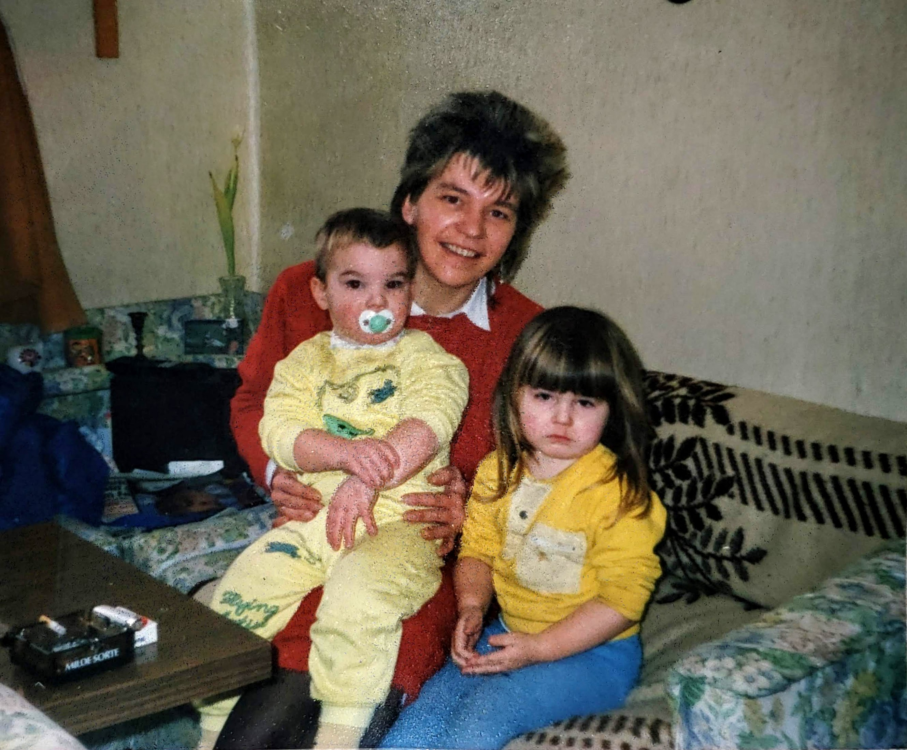
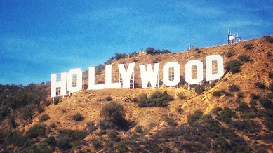
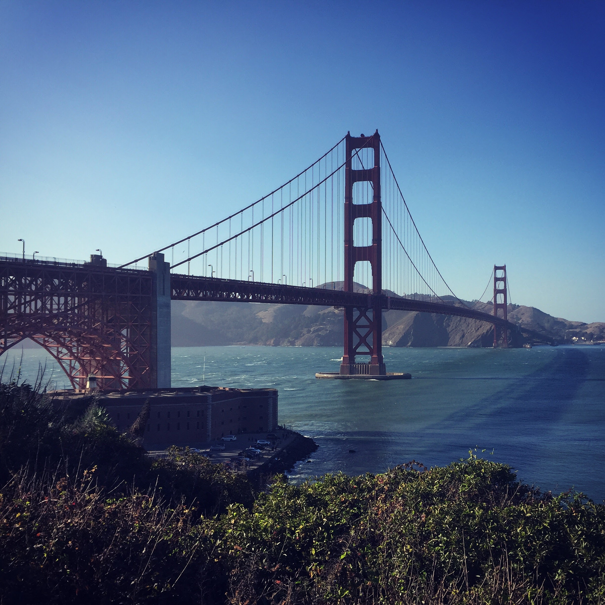
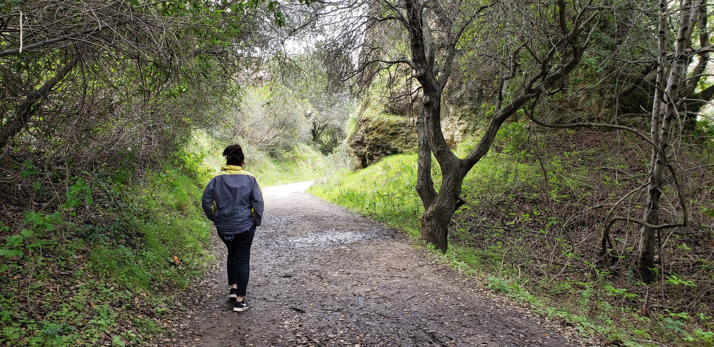
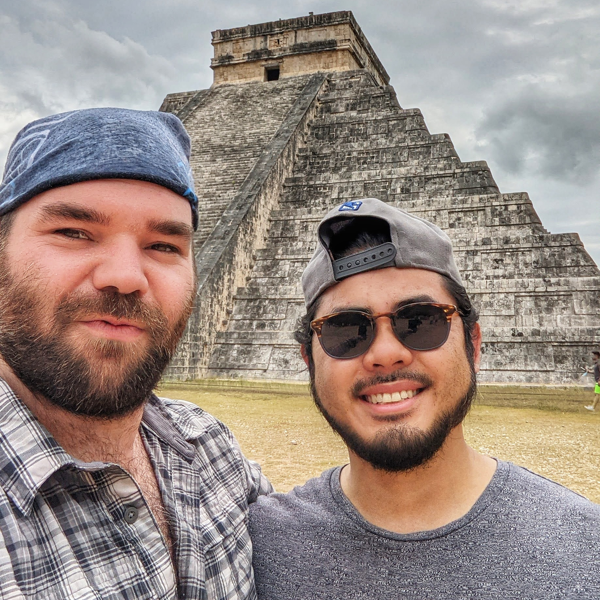

# About Thomas

Who am I? Who is anyone, ever, really? Okay, so you didn't come here for a pseudo-intellectual philosophy lesson. Right, not sure why you would want to read an essay like that, but let me get to it:

{.float-lg}

I was born many years ago in Austria. Actually, in 1985 to be precise. And yes, that would make me a Millenial. So I did grow up just before the internet but already had my wits about me when it became widely adopted.

In middle school, I was one of the first kids running around with a mobile phone. We didn't have an AppStore, but the snake game on my Nokia was fun.

Growing up with computers and phones was a blessing for me. My childhood wasn't always easy, and technology gave me a lot of opportunities to distract myself from everything else that was going on. Not only was I passionate about it, it turned out that I was also quite good at it.

In the late 2000s, I got increasingly frustrated with my life. Living in a full-blown victim mentality, I expected the world to owe me something. I guess that mindset gave me the cochonnes to travel to Los Angeles with only $100 in my pocket to become an actor.

{.pull}

As you probably guessed, I didn't make it on the big screen, not even the little one. But what I learned from that trip was a mindset shift. Three months flew by, and when my tourist visa ran out, I had to go back to Austria.

Shortly after, I became depressed. As a high school dropout, I couldn't see a way to move to the United States permanently. And that's what I wanted so badly.

There were two options available for me:

1. Marriage, but that goes against my beliefs
2. Skilled worker transfer, that's a taker

I started interviewing with companies like Sony for web development positions. The only requirement I had was US offices and a possibility to be transferred down the line. Salesforce checked both boxes, and so I started working for them in Ireland.

Within two years, I worked my way to an L1 visa and got transferred to San Francisco. And so, my journey to a Green Card started.

{.float-md}

For Salesforce to apply and ultimately pay for my Green Card, I had to have been in the US for at least a year. So I couldn't do anything but wait to progress on that quest.

With the newfound free time, I started to focus on other things like health and well-being. At the time I moved to SF, I weighed in at 300 lbs. Not believing a woman could love me like that, I made it my mission to lose that weight. I started to work out religiously 5-7 times per week. And after only six months, I had lost 100 lbs.

After living in the US and losing that much weight, you would think I would be happier. However, that wasn't the case. I made more friends at work, started going out more, and experimented with drugs like cocaine.

And that was eye-opening! Cocaine changed my brain chemistry; it made me less anxious and more outgoing. Contrary to popular belief, I never got addicted to it. Not like my cigarette addiction. But it showed me what's possible and started me on a quest of figuring out my brain.

Podcasts became my new obsession. I would listen to everything under the sun dealing with health, fitness, and how to change your thoughts to become more attractive. I started to meditate, dance, and mentor high-school students.

One day, around Thanksgiving, I decided to do a 26 miles urban hike around San Francisco. Only bringing 2 liters of water meant I was increasingly dehydrated hiking up Bobcat Trail in the Marin Headlands. My mom and sister were vacationing in Israel at the time. And after pondering how I would fight off a bobcat, I started imagining how I would learn how to fight with the Israeli Army to free my mom and sister, who a group had taken for ransom. I did recognize that my brain was going wild, but I wanted to discover more of my crazy brain.

Many hours of research later, I decided I was going to hike the Pacific Crest Trail. What better place to discover the depth of your brain than a 2,650-mile walk through the mountains?

My Green Card arrived just in time to take a 4-months sabbatical for this adventure. Suffice it to say: it was an insane time. I gave up my apartment, gave up most of my belongings, traveled to Seatle, and started walking.

Coming out of it, I had a newfound appreciation for stillness and learned how to manage my thoughts.

After returning to Salesforce, I knew that wasn't what I wanted to do with my life. In no short order, I started to mentor and coach my co-workers. A few months later, I flew to Austin, TX, to become a certified Life Coach.

And once again, everything changed when I got back. I met Audre, a beautiful human being, and my first real romantic relationship. Never having experienced a connection like that, I was eager to learn and made oh so many mistakes. I was trying to change myself to what I thought she wanted. And it suffocated me. Within 11 months, the relationship had become very toxic. Luckily Audre saw that and ended the relationship. I got crushed.

Many months later, I was still trying to cope with the loss. And all my thought management seemed to fail me. I needed to heal, not only from the loss of that connection but from all the sadness I had bottled up in myself over many years.

Through podcasts, I've heard for years about ayahuasca and the healing journeys people go on. So I decided to seek that for myself — fortunately, in October 2019, I found the right place and the right people to go on this journey. It was like hundreds of hours of talk therapy rolled up in a 5-hour long session. And it made me a believer in plant medicine.

{.float-lg}

The healing I was allowed to feel gave me new strength in my mission to help others. I started to coach others again and worked on a mobile app to help others elevate their mental well-being. By the end of 2020, I decided to become financially free, giving me more time to help more people.

I dove deep into the rabbit hole of the economy to understand and make better investment decisions. And within a year, I reached my goal of financial freedom.

My life has been shaped by so many people and so many circumstances. I could write a book of "Thank yous" to cover everyone and everything. So instead of doing that, I'm just going to say, "Gracias a mi Familia!" I love you all and will never forget you.

So what's next? Many projects. But first and foremost, when I retire next year, I'm going to go on a quest to become a Curandero. I'm going into the Amazonian jungle to learn as much as I can about plants and their healing properties. And along the way, I'll be sharing my learnings on this blog.
