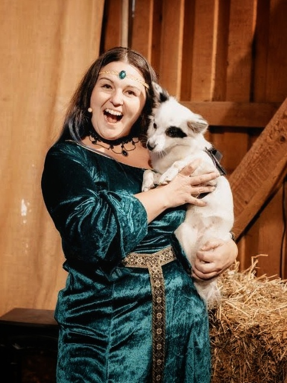

# My Big Sister Is A Published Author

{.float-lg}

It's been a wild ride growing up with a big sister. For the first few years of my life, I couldn't do anything wrong. I always was the good boy, and she was the bad girl. But then she decided to become a good girl. No matter what it takes.

I still remember when we were playing with fire in the living room. She wanted to try burning a tissue so bad. After she begged me for what must have been hours, I finally gave in and let her try.

Of course, my scared big sister dropped the tissue on the carpet. No way I could put it out quickly enough as to not leave a stain. But what did my sister do? She left me to deal with the aftermath.

And that's just one example of how I became the bad boy.

Apart from those rivalries, we were thick as thieves, though. She was always there to help me out of a bind, and so I was for her.

Over the years, she has accomplished a lot. In her late teens, she decided to move to Hamburg and help the homeless on the [Reeperbahn](https://en.wikipedia.org/wiki/Reeperbahn). Not just anywhere but the biggest red-light district in Germany.

From there, she decided to join the [Salvation Army](https://www.salvationarmy.org/), and while leading a corps in Switzerland, she also did a bachelor's in Christian Leadership. Because doing one of those isn't tricky enough.

Yeah, that's my big sister. And now she also is a [published author](https://www.amazon.de/dp/B09L58V1H1).

> Christin, thank you so much for always showing me how much is possible. You're a true inspiration. I'm so lucky to have you in my life and wish you all the best. ❤️ Love you!
