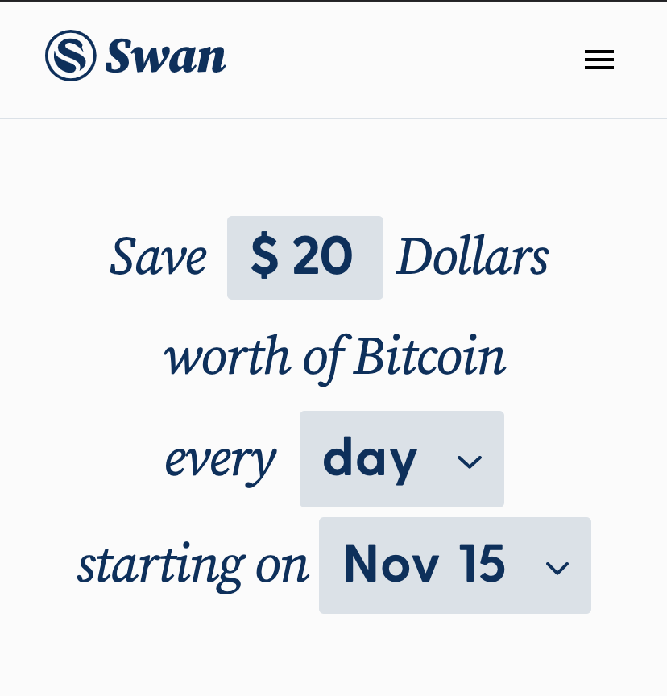
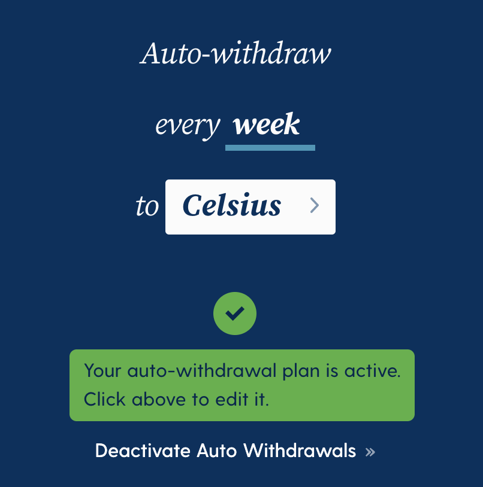

It's actually kind of hilarious: with index funds, I was happy about 10-20% annual growth. In stocks, I'd be glad to see 50% growth. But crypto is different. People seem to get upset if it doesn't go up by at least 200%.

> If you're only focused on the price moving up, you're missing the picture.

Yes, you can make boatloads of money in crypto. But even more importantly, you can take charge of your financial freedom. For the first time in history, you can take total control of your wealth. All you need to do is remember 24 words. No nation-state can seize your property. Wherever you are is where your money-vault is. Let that sink in for a moment.

---

Ok, now let's get you started on your journey of freedom. My assumptions for this blueprint are: you're in the United States, you're either new to crypto or trading memes on Robinhood, you want to get serious, but you don't want to actively manage it.

Here is what you'll get: we're going to set you up with a service that purchases Bitcoin for you. We'll set up a weekly/monthly [dollar-cost-averaging](https://www.investopedia.com/terms/d/dollarcostaveraging.asp) routine. For example, every Friday, $50 is pulled from your bank account and invested into Bitcoin. Automatically, without you having to do anything. And, if you so choose, we'll set you up with a Bitcoin savings account that earns you interest on your Bitcoin while you're sleeping.

## 1. Set up Swan Bitcoin

Fair warning upfront: this is not the cheapest way to buy Bitcoin, but it is by far the most convenient. A minimal learning curve, and once you're done, you don't have to think about anything. Also, this is a _referral link_ you don't have to use if you don't want to.

1. Go to [Swan Bitcoin](https://swanbitcoin.com/thomasstachl)
2. Type in your email address and click "Get Started"
3. Check your email for a verification code
4. Click the button in the email and put in your verification code
5. Verify your phone number
6. Verify your identity
7. Set up your savings plan

{.float-lg.!mt-2}

As you can see in this screenshot, setting up a savings plan with Swan Bitcoin couldn't be any easier. You have to say how much you want to save, how often, and when to start it.

Just buying bitcoin is nice, but receiving interest on the bitcoin you own is even nicer. And that's what we're tackling next. With Swan Bitcoin, you can automatically set up a withdrawal address that you want to send your Bitcoin to. And that will be your bitcoin "savings account" with Celsius.

## ~~2. Bitcoin Savings Account with Celsius~~

**IMPORTANT UPDATE: Don't ever send your Bitcoin anywhere but your own hardware wallet! If possible make it a Coldcard Wallet.**

Celsius Network is a company that specializes in generating [yield](https://www.investopedia.com/terms/y/yield.asp) for their customers. That means you put your Bitcoin into your Celsius account. Celsius lends them to its institutional clients. Those clients pay Celsius for borrowing your Bitcoin. And finally, Celsius pays you.

Technically, in this scenario, you're trusting Celsius with your Bitcoin. And for the risk you're taking, you're earning 6.2% interest up to your 1st Bitcoin. Some might say it's not worth it; I think it's a fair deal. Also, seeing my balance grow every week without doing anything is a nice feeling. So, how does it work:

1. Go to [Celsius.network](https://celsiusnetwork.app.link/138289a9a6) (_referral link_)
2. Download the app
3. Go through the sign-up flow
4. Don't forget to enter my referral code ;)
5. Create the wallet
6. Set a pin code
7. Verify your profile (KYC - Know Your Customer)
8. When completed, click the "C" button in the lower right corner
9. Choose "Receive"
10. Change the asset to "Bitcoin"
11. Click "I Understand"
12. Copy your Bitcoin wallet address "bc1..."

## 3. Automatic Withdrawal from Swan to Celsius

Last but not least, you want to make sure your Bitcoin purchases in Swan are automatically sent to your savings account. To do that, you'll have to log back into Swan Bitcoin.

On the Swan Bitcoin dashboard, scroll down until you see "Auto-withdraw every ...". Click on "connect your wallet" and select "connect to single address." I just called mine "Celsius," but you can call it whatever you like. Paste the Bitcoin address you copied earlier into the address field.

**Double and triple check the address is correct!**

Then click "validate and use the address." After you confirm your wallet, you should now be able to set up auto-withdrawal. I have mine set up to withdraw my funds to Celsius every week:

---

This is it! My recommended setup for new crypto investors.

There are many more options for buying bitcoin and other cryptos. There are exchanges that charge you lower fees. There are ways you can set limit orders and stop losses. And all of that is great for people who have the time and willingness to learn how to use those tools.

For everyone else, this guide is as simple as it gets.
